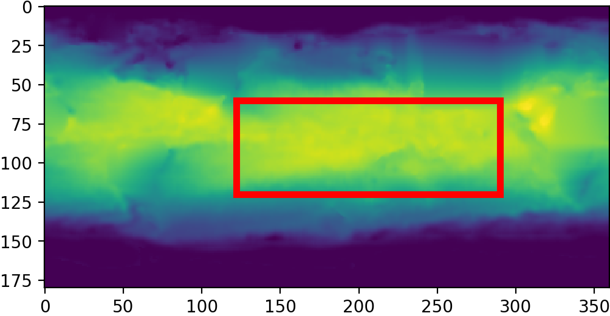
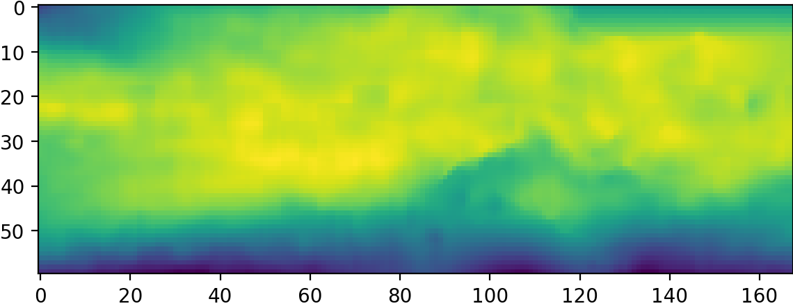

# Multi-GPU Spatio Temporal Neural Network 

This document will outline the work completed over the past semester on modifying a spatio-temporal forecasting model to be able to train on spatially-large dataset. 

## Introduction
Spatio-Temporal Neural Network ([STNN](https://ieeexplore.ieee.org/document/8215543)) was a model introduced by Ziat et al. 2019 that demonstrated SOTA results on a wide variety of spatio-temporal forecasting tasks (e.g. traffic, disease, ocean-temperature). It did so, in part, by representing the inter- and intra-dependencies between and within each timeseries. Consider an arbitrary dataset $D \in \mathbb{R}^{a \times b \times T}$ where $a, b$ are the sidelengths of the spatial area and $T$ is the length of the time series at each pixel. The inter-dependences, or the dependency between each pixel and every other pixel, are represented via a relational matrix $W \in \mathbb{R}^{n \times n}$ where $n = a*b$. As such, the total number of pixels grows quartically to the side length of a given spatial area. That means training a model on an area $100 \text{ pixels} \times 100 \text{ pixels}$ requires $\sim 16\times$ more memory than an area $50 \text{ pixels} \times 50 \text{ pixels}$. In practice, we found that the model, as it was published on GitHub on a V100 GPU with 16GB of memory, could only train a $50\times 50$ pixel area. 

Training large areas could only be accomplished by downsampling a larger area, decreasing the area of interest or a combination of the two. This was problematic because spatio-temporal patterns often occur over large areas while useful forecasts require a certain level of grandularity to be useful. The need to adapt this model to work on larger datasets, i.e. multiple GPUs, became obvious. 

## Methods 
The main challenge in parallelizing the model was how to go about storing the adjacency matrix in a way that balanced accessability with computational effeciency. The adjacency matrix is quite sparse meaning storing it in a sparse representation could allow it to easily fit in device memory—assuming the area is not so large. On balance, such an approach would yield a large increase in the maximum trainable area. However, for the refinement network version of the model, the tensor operations needed are not supported in PyTorchs COO sparse tensor class. 

The next approach was to implement a multi-gpu model a much lower level using CUDA/C++. Nvidia recently released a mutli-GPU verson of their cuTENSOR package, cuTENSORMg. Using this packaged proved to be a challenge for multiple reasons, not least of which were due to a lack of experience with CUDA, a nontraditional API per an Nvidia PM and a lack of documentation/support due to the package being so new. The benefit of this package was its automatic management of distributed tensor contractions accross host and device GPU.

This lead to the final implementation which was to use PyTorch's built in device conversion method `.to(device)` to integrate hard-coded memory mangement directly into the runtime of the model. At a high level, this method requires a minimum of 2 GPUs (GPU A and B) and a host with sufficient memory to store the adjacency matrix. The model itself sits on GPU A and contains an encoder and decoder NN. The adjacency matrix sits in host. Recall the adjacency matrix $W\in\mathbb{R}^{n\times n}$. However, many spatio-temporal patterns have mutliple relations, so $W\in\mathbb{R}^{r\times n \times n}$ where $r$ is the number of relations. When the model calls `get_relations()`, a subset $W' \in \mathbb{R}^{r^\prime \times n \times n}$ where $r^\prime \in [0, r]$ is transfered from host to GPU B where it is masked per a set of learned weights and then passed back to host. This is repeated $r\mod r^\prime$ times until the entire relational matrix is modified. This same procedure is done for the matrix multiplication steps as well. 

### Data
In order to make the results of this work comparable, we choose to replicate the Pacific ocean temperature experiment in the Ziat et al. In that experiment, they resampled as area of the pacific ocean of size $60 \times 168$ pixels where each pixel represents $1 \times 1$ degrees of the earth down to a an area $30 \times 84$ with a pixel resolution of $2 \times 2$ degrees. 

As a demonstration of the purpose of a multi-GPU model, we skipped the downsampling step, maintaining the original $60 \times 168$ pixel area. Although an area twice the size, it represents 4x as many pixels and requires an adjacency 16x as large. 
## Results 

The model on a single V100 GPU with 16GB of memory overflowed on the full resolution PST dataset.

It is difficult to quantify the effeciency of this implementation because it can't be compared to runtime on a single GPU since it won't fit on a single GPU. As such, we can only concretely quantify its speed up coompared to doing all tensor operations on host. 

However, we can potentially esimate the runtime. [Dece AI.](https://deci.ai/blog/flops-vs-run-time-comparison/) examined runtime performance and effeciency for matrix * vector computation on GPU for various matrix size. They found that from GPU computation time for a matrix $2,500 \rightarrow 10,000$ had a 5x increase in runtime. As such, 

| Model | relation size | # batches/sec | 
| --- | --- | -- | 
Small dataset | 2,520  | 40 | 
Full Res single GPU | 10,080 | **8*** | 
Full Res multi GPU| 10,080 | 3 | 

\* This is an estimate based on the runtime metrics above. 

The above runtime estimates gives an very conservative upper-bound on theoretical optimal runtime performance of this model. STNNMg in its current implementation is slower by factor of 3. 

The model ultimately achieved similar accuracies to the model in Ziat et al., due to the fact that the core architecture did not change. 

## Discussion
While the results here are promising, there are many limitations. First, the model is limited to 2 GPU setup. So it being multi-GPU is only true so far as 2 defines multi. As such, a more robust framework should be built for spreading the adjacency computation over multiple GPUs instead of just spreading the model over mutliple GPUs as was done here. Finally, the adjacency matrix is very sparse and the optimal strategy would be to implement this using a sparse matrix representation. 

